# 5. AI Pipelines
The **Watson Pipelines** editor provides a graphical interface for orchestrating an end-to-end flow of assets from creation through deployment. Assemble and configure a pipeline to create, train, deploy, and update machine learning models and Python scripts.

Watson Pipelines is already configured once the service is installed.

We're going to create a pipelines to refine data, train a model, choose the best model and deploy it in a deployment space. Through the use of pipelines, you can automate this process and parametrize to send different pipelines to cover several scenarios.

## Pipeline description
We are going to create a pipeline to run an AutoAI experiment and deploy to a deployment space. Steps of pipeline would be:

    1. Run existing Data Refinery flow job (drjob) to create a csv with shaped data (customer_data_transactions_csv_shaped)

    2. Create an AutoAI experiment

    3. Run the AutoAI experiment and select the best model

    4. Promote the selected model to the a deployment space (existing dev deployment space)

    5. Deploy an online deployment based on the model selected.

You can see a diagram of the pipeline to create:

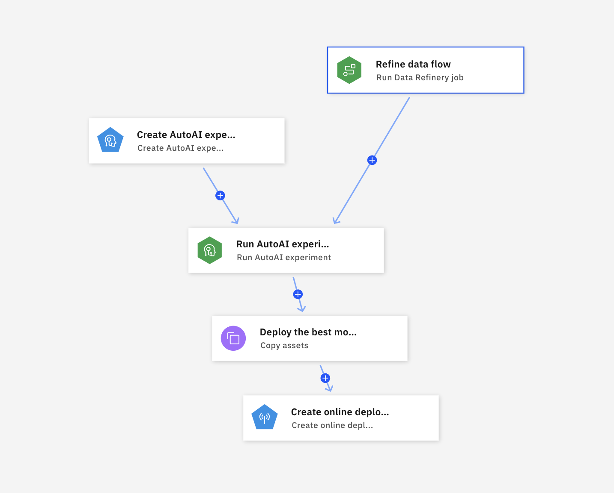

## Pipeline creation
1. Open your project **<YourUser\> Customer Churn Prediction**
2. Click the **New Asset+** button.

    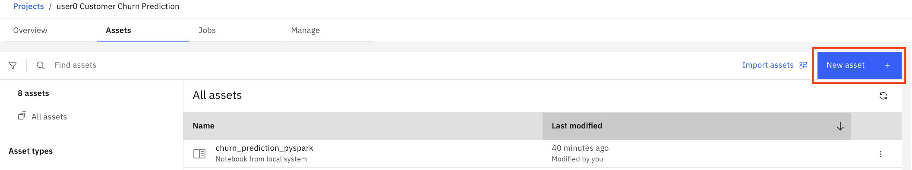

3. Then, select the asset type Pipelines:

    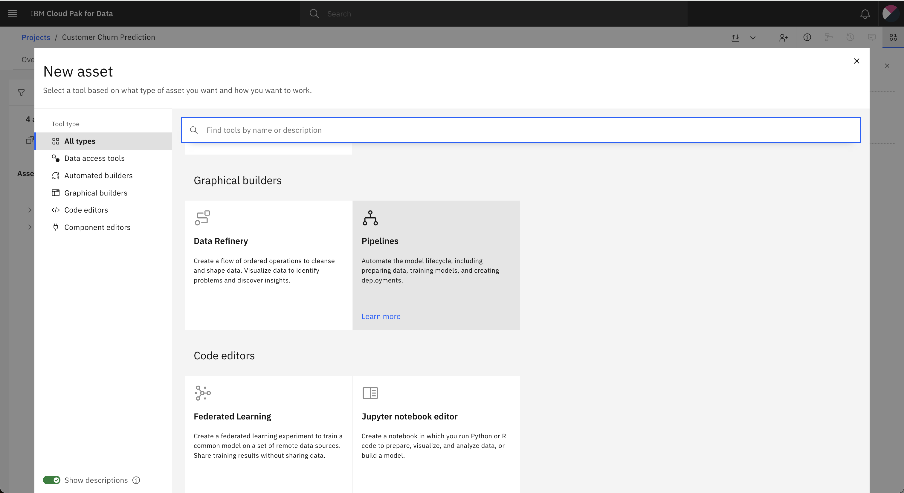

4. Enter the name **<YourUser\> Customer Churn Pipeline** and the description **Pipeline to create and run an AutoAI experiment and deploy the best model to UAT deployment space**. Then click **Create**.

    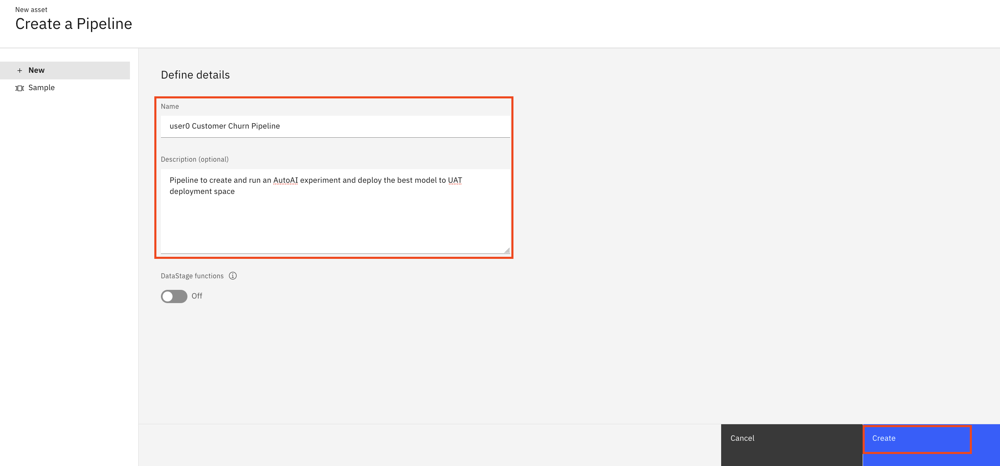

    !!! tip
        We don't select Datastage functions because this service is not installed.

## Create an AutoAI experiment
1. Drag a **Create AutoAI experiment** node to the canvas, then click on the **three dots** at right side of the node to expand options and click **Open**. The settings for this node will expand at the right hand side:

    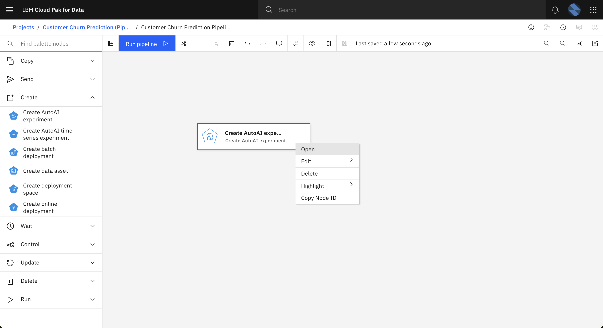

2. Set the following settings. Some settings will remain void to set by default options:

    - **AutoAI experiment name**: Will fill in with the name "Customer Churn pipeline experiment"
    - **Select Scope** is the project of space where the experiment will run. Select your project
    - **Prediction type** is the type of experiment we want to run: Binary classification, Multiclass classification or Regression. We select "Binary classification". Note that Time Series experiments are created with other node type.
    - **Prediction column**: "*CHURN*"
    - **Positive class**: "*T*"

    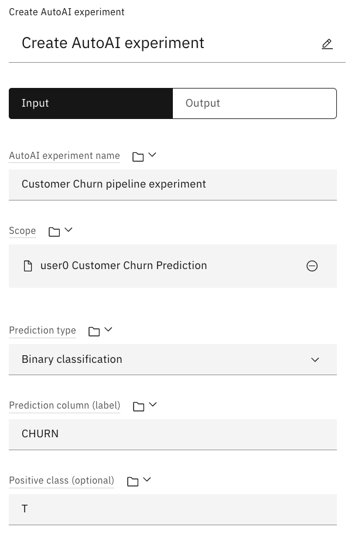

    - **Training data split ratio**: Leave 0.9 as by default value
    - **Algorithms to include**: Algorithms to test during the AutoAI, leave it by default to take all of them into account
    - **Algorithms to use**: How many top performers algorithms to use to create the subsequent pipelines, set it to 1 to reduce compute time
    - **Optimize metric**: By default
    - **Hardware specification**: You can select a hardware specification defined in the project or in any other location. Select the CPUx2 size: *2 vCPU 8GB RAM*

    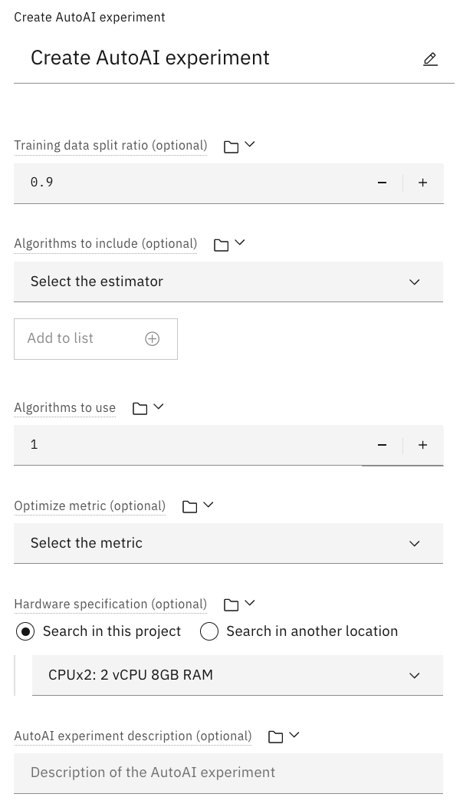

    - **AutoAI experiment description**: "AutoAI experiment to select best model to predict customer churn"
    - No tags
    - **Creation Mode**: This is the action taken when the experiment finds another one with the same name: We select "Overwrite" to overwrite the existing AutoAI experiment.

    Then click **Save** to save this node's settings.

    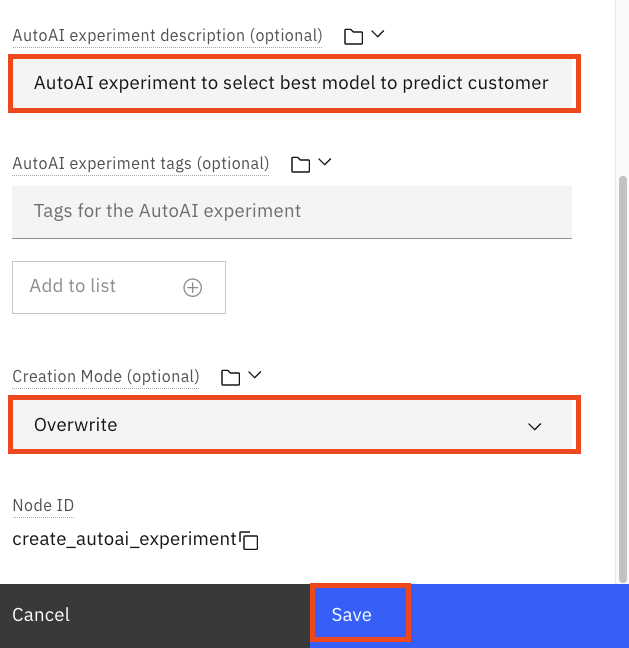

## Running a Data Refinery job
1. Drag a **Run Data Refinery job** node to the canvas then click on the **three dots** at right side of the node to expand its options. Click **Open** to open the node settings at the right hand side:

    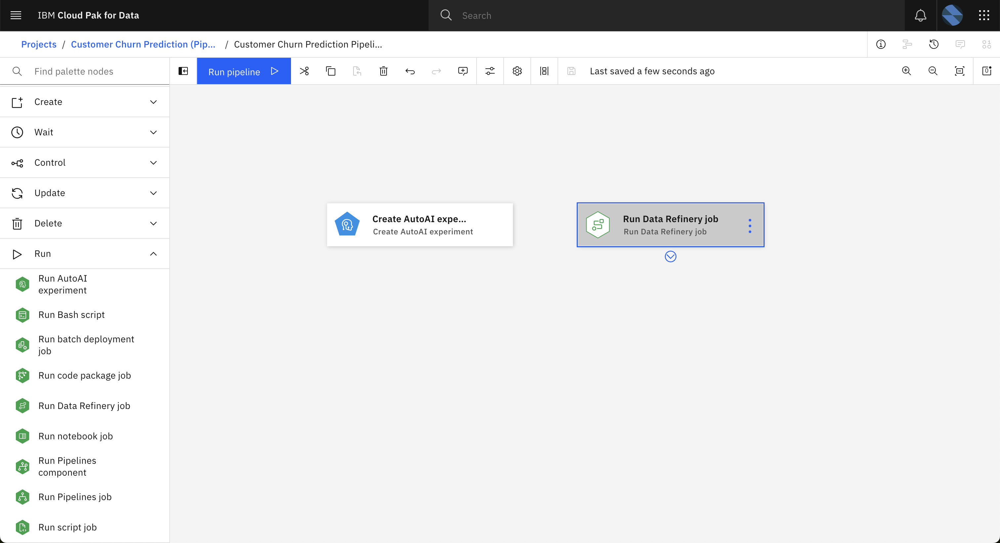

2. Set the following settings:

    - **Data Refinery Job**: Select the job you created in the previous lab **<YourUser\> drjob**, from the current project.
    
    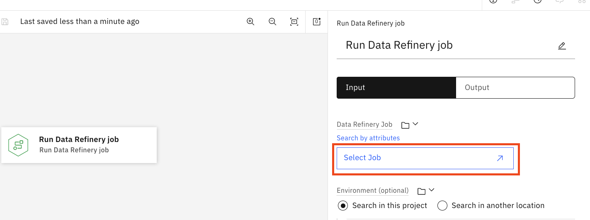

    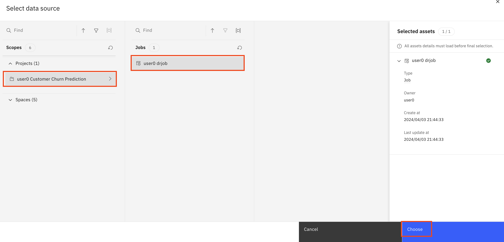

    - **Environment**: Select the "*Default Data Refinery XS*" environment
    - Don't override the default error policy, which states that pipeline will fail if error happens in this node.

    Then click **Save** to save this node's settings.

    

## Running the AutoAI Experiment
1. Drag a **Run AutoAI experiment** node to the canvas and connect it to the previous nodes as shown below.

    !!! info
        Note that links are not related to any data movement, but the sequence flow. The link between nodes notes the sequence of the process, and prevents the 2nd node to start before the 1st node has finished.
    
        In this particular case, the AutoAI experiment will start only if the AutoAI experiment has been created and DataRefinery job has finished, because it needs both elements to start the run.

    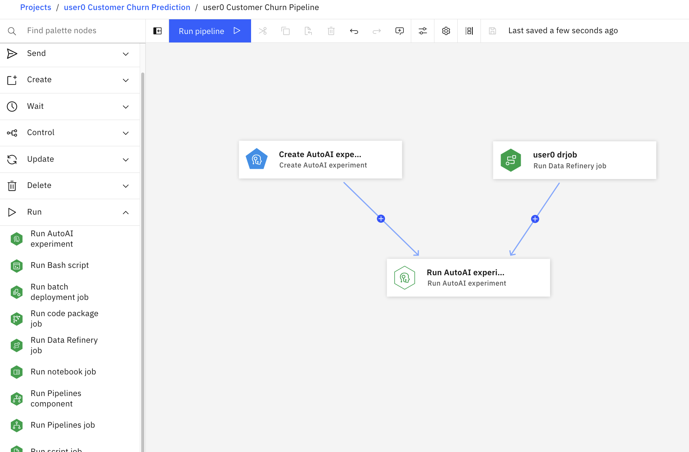

2. Open the node. You could select any AutoAI experiment from your project, but in this case we're going to use the option **from another node**. This will use the experiment generated in the node "**Create AutoAI experiment**". Note that the type of result for this node shows as ("*AutoAI experiment*") when selecting it.

    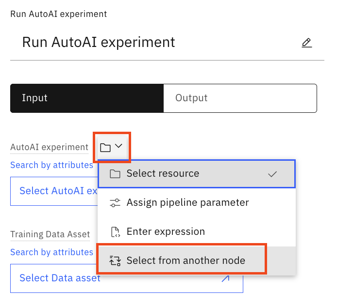

    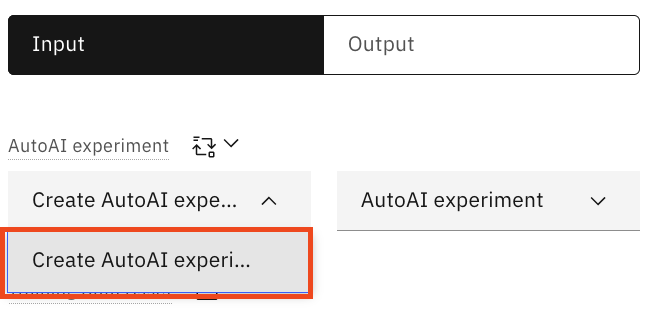

3. Select the **Training Data Asset** to train the model. In this case, select the CSV file **CUSTOMER_DATA_ready** in your project. This is the file that's generated by the Data Refinery job.

    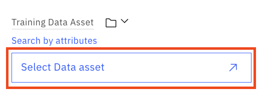

    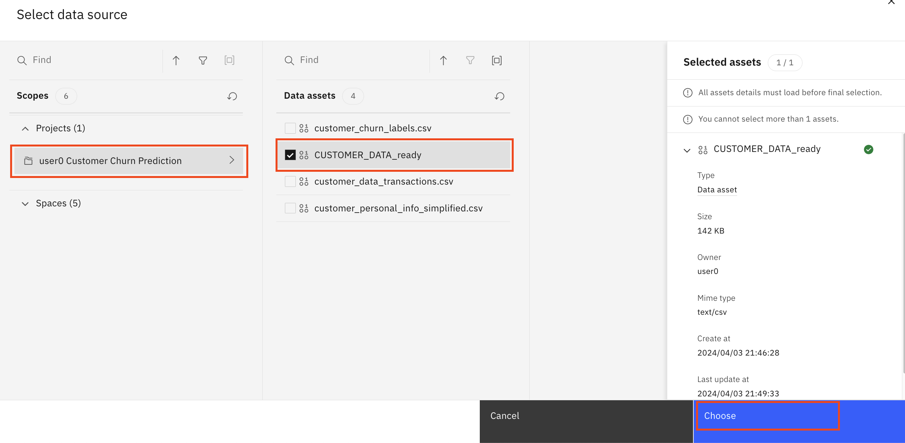

4. Check the rest of this node's properties:

    - Don't select a holdout dataset
    - **Models Count**: Number of best models to create. Set it to 1 to get the best one only.
    - **Run name**: The name of each run, we leave it by default, it will define an automatic name.
    - **Model name prefix**: Leave it by default. It will use "<experiment name>-"
    - **Run description**: Insert the following description: "AutoAI experiment for predicting the likelihood of a customer to churn with a training Dataset shaped from selected data"
    - Change the **Creation Mode** to "Overwrite", to allow overwriting models already created.
    
    Finally, click **Save** to save this node's settings.

    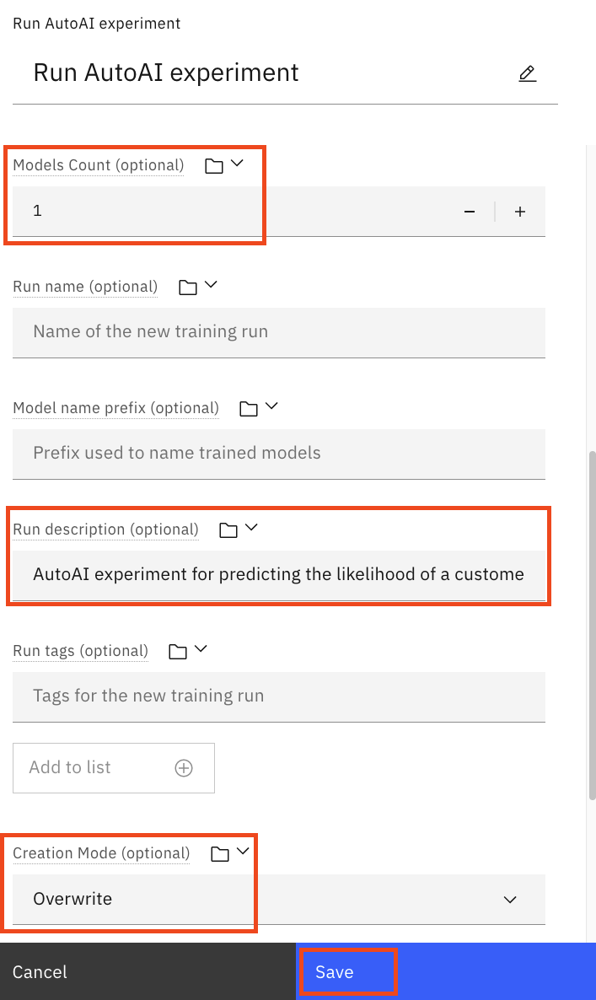

## Promote the generated model
The next step is to promote the model selected in the AutoAI experiment to a deployment space ("churnUATspace"). This is done with the "Copy assets" node.

1. Drag a **Copy assets** node to the canvas and connect it to the "Run AutoAI experiment" node as seen in the screenshot below. This connection is needed to get the model result of the previous node to use it in this node:

    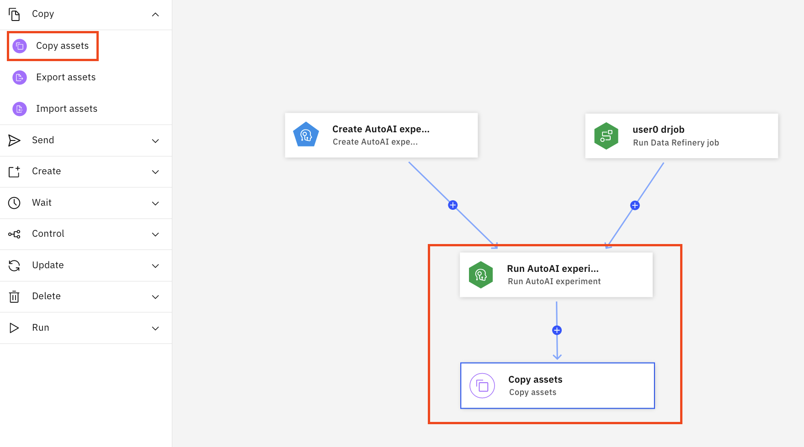

2. Open the node settings. The **Source Asset** will be the best model selected in the previous node. Choose the **Select from another node** option and select the "Run AutoAI experiment" node, and the **Best model** option.

    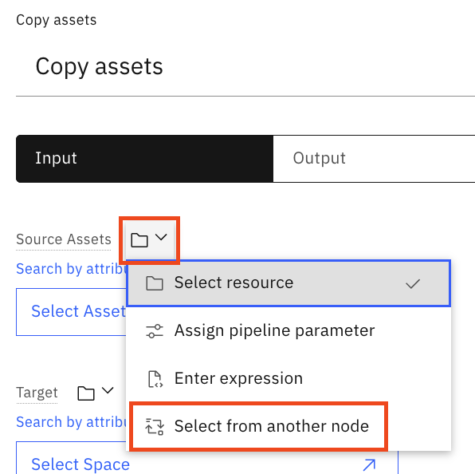

    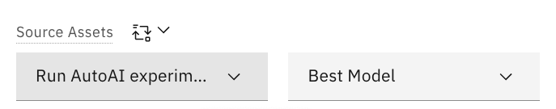

    !!! tip
        Note that you could choose 2 options from an AI experiment: "The best model" to select the best model and "Models" to select all the models that were generated.

3. For the **Target**, select the **churnUATspace** deployment space.

    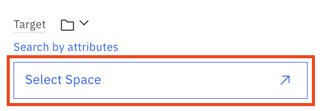

    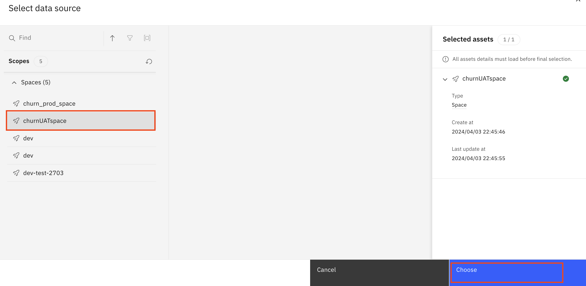

4. Finally, select the **Overwrite** mode to overwrite the model in the space each time we run the pipeline. Then click **Save** to save this node's settings.

    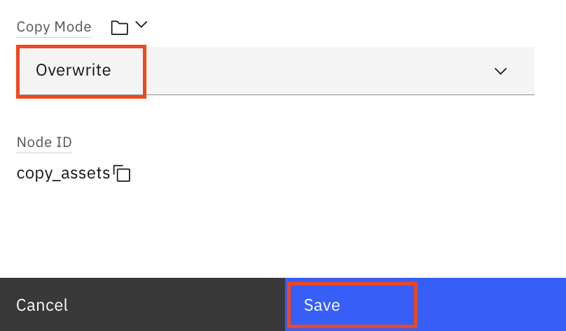

## Deploy the model
The final step is to deploy an online model based on the model that was promoted to the deployment space.

1. Drag a **Create online deployment** node to the canvas and connect it to the "Copy assets" node as seen below. This connection is needed to get the model promoted to the deployment space in the previous step, and use it in this node.

    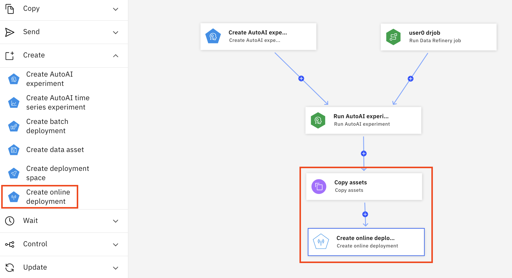

2. Open the node settings. Set the option to **Select from another node** and select the "Copy assets" node, using the model that was promoted **winning_model**.

    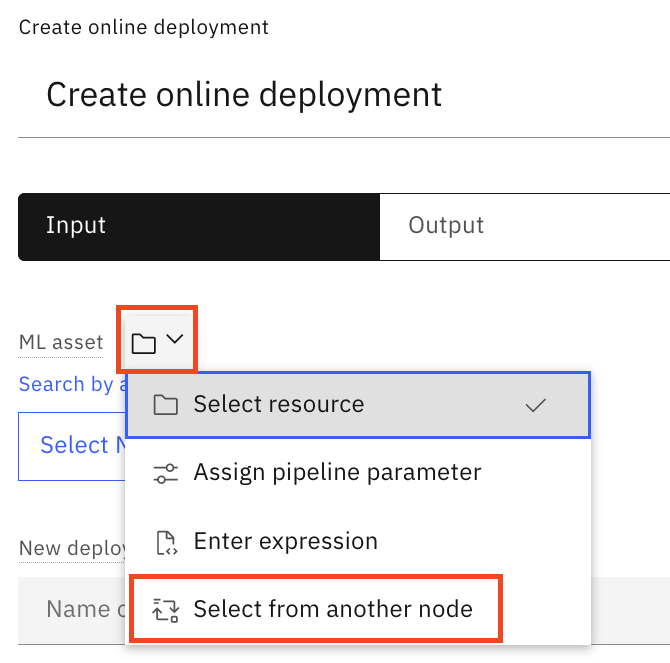

    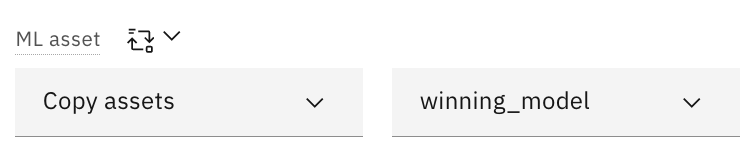

3. Select the **Overwrite** option for "Creation Mode", to let it overwrite the deployment in case there is an existing one. Leave "New deployment name", "New deployment description" and "New deployment tags" by default. Then click **Save**.

    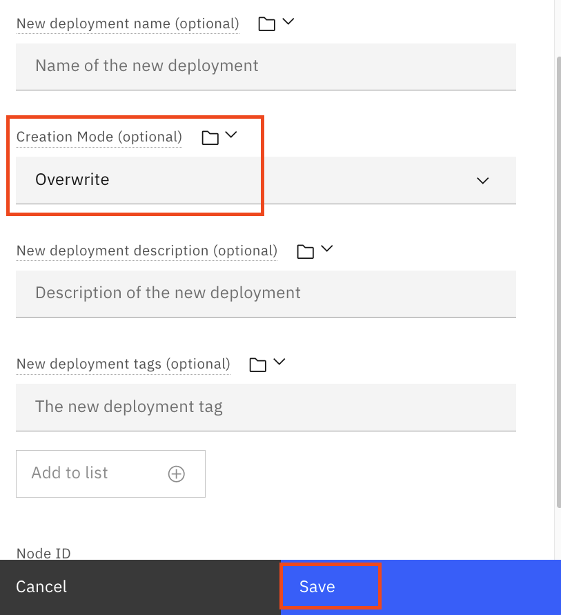

4. Finally, you can run the Pipeline as a **Trial Run**. This creates a trial job to run the pipeline. You could also create a job to schedule it or run it by demand.

    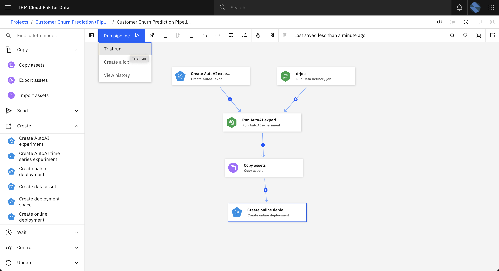

    For the Job run name, use **<YourUser\>_testrun**. Then click **Run**.

    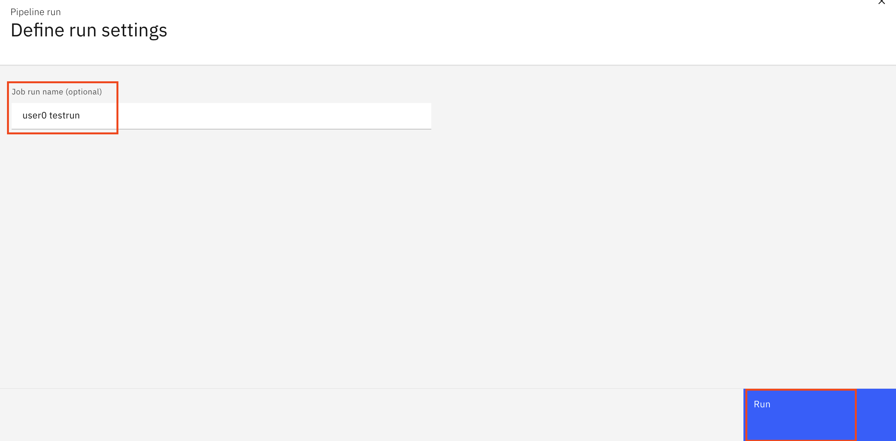

5. During the run, you can inspect logs clicking on the node:

    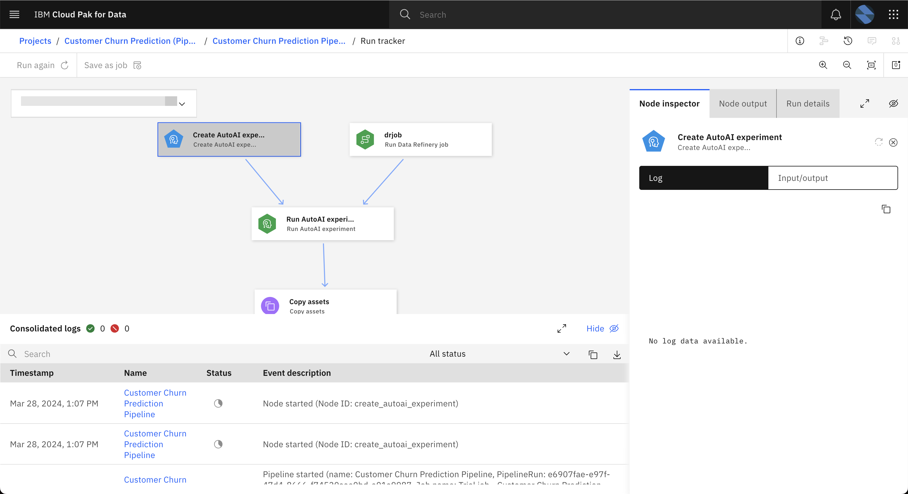

## End of Lab