# 2. Model Training

## Exercise 1: Train AutoAI Model for Churn Prediction
In this section, we illustrate how to leverage AutoAI to quickly train multiple AI models for churn prediction and select the pipeline that delivers best performance.

1. Navigate back to your project and click **Assets** tab, click **New asset** + and select **AutoAI**.

    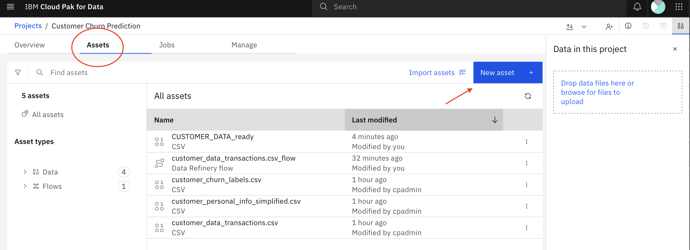

    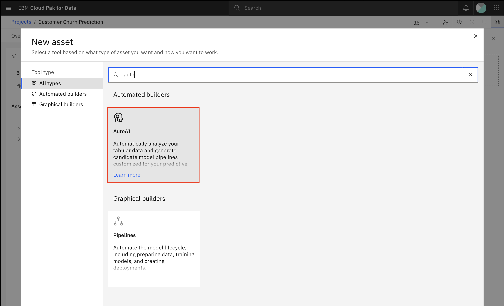

2. Provide the following name to your AutoAI experiment: **<YourUser\>_autoai_churn_prediction**, keep the default Compute configuration and click Create.

    !!! tip
        You could select a different configuration if you needed to assign more resources for your AutoAI experiment.

    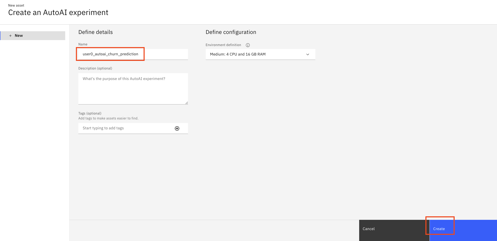

3. On the AutoAI add data sources page, click the **Select from project** button since you will be using the dataset you had created earlier with Data Refinery.

    !!! tip
        You could also click Browse to upload data from your local machine.

    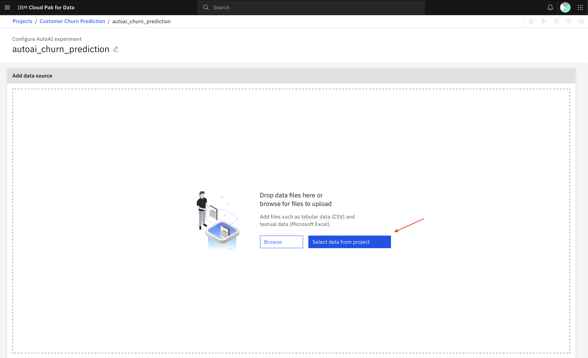

4. Click Data asset and select the checkbox to select the **CUSTOMER_DATA_ready** dataset. Then click **Select asset**.

    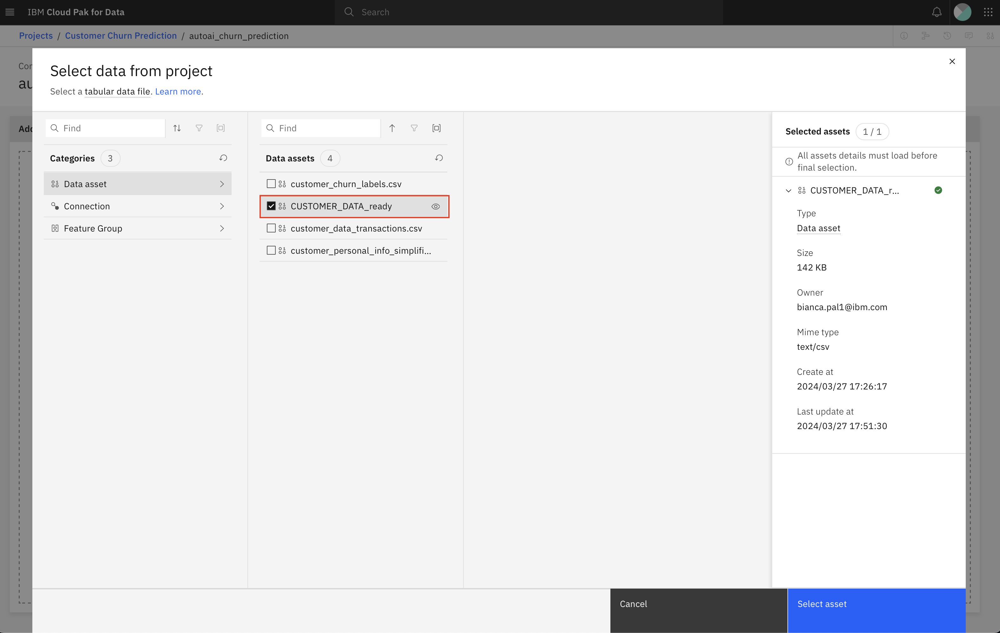

5. On the next page, you will see the selected dataset and you will be prompted to select whether you want to Create a time series forecast which is supported by AutoAI. Click **No** since customer churn prediction is a classification use case and not a time series forecasting use case.

    Once you click No, you will get the option to select which column to predict. Scroll down the list to select the **CHURN** column. At this point, we have provided the data set, indicated it is a classification use case and selected the prediction column. Click **Run experiment** (blue button) to kick off the AutoAI run.

    !!! tip
        Note that you can click the Experiment settings to review the default settings and change some of the configurations if you wish. Review those settings as they’re very informative.

    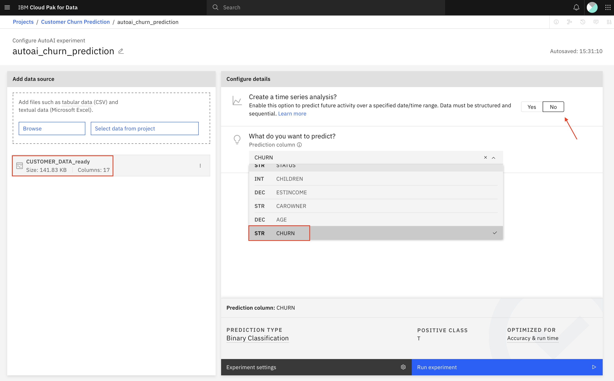

6. AutoAI runs for a few minutes on this dataset and produces a number of pipelines as shown in figure below including training/test data split, data preprocessing, feature engineering, model selection, and hyperparameter optimization. You can dig deeper into any of the pipelines to better understand feature importance, the resulting metrics, the selected model, and any applied feature transformation.

    !!! tip
        While waiting for AutoAI’s run to complete, you could review the [AutoAI Documentation](https://www.ibm.com/docs/en/cloud-paks/cp-data/latest?topic=models-autoai).

        Specifically, review the [AutoAI Implementation Details](https://www.ibm.com/docs/en/cloud-paks/cp-data/latest?topic=autoai-implementation-details) to understand what algorithms are supported, what data transformations are applied and what metrics can be optimized.

    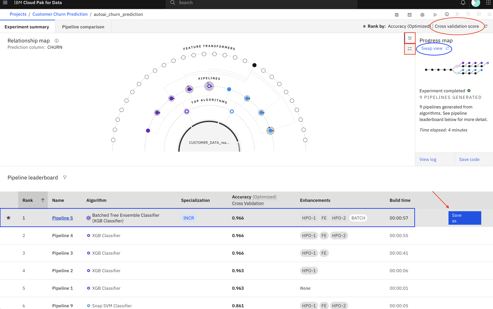

    The AutoAI run will take 4-5 minutes to complete. Once complete, please spend a few minutes exploring the dashboard:
    
    - Switch between the **Experiment details** and the **Legend** information (annotated with red rectangles in previous figure) to better understand the generated Relationship map.
    - Switch between **Cross Validation** and **Holdout** results by clicking the icon next to Cross Validation (annotated with red oval in previous figure) to see how the pipeline ranking changed depending on which data is being evaluated.
    - Swap the view between the **Relationship map** and the **Progress map** (annotated with blue oval in previous figure) to see the different views of the AutoAI pipeline creation process.
    - Click on the top pipeline (annotated with blue rectangle in previous figure) to review the details for that pipeline. AutoAI reports several valuable evaluation criteria like several performance metrics (Accuracy, Area under ROC, Precision, Recall, F1) as well asthe confusion matrix, Precision Recall Curve, and feature importance. If the pipeline also included feature engineering (or feature transformation), the pipeline details will explain what transformations were applied. Close the pipeline details window by clicking x top right of window.

    After reviewing the trained pipelines, you can decide which one you’d like to save as a model to deploy. Assuming you select the first pipeline, mouse over the first pipeline and click **Save as** (annotated with red arrow in figure above).

1. On the Save As page, select **Model**, keep the default name, and click **Create**.

    !!! tip
        Note that you could also save the pipeline as a Notebook which you can customize further.

    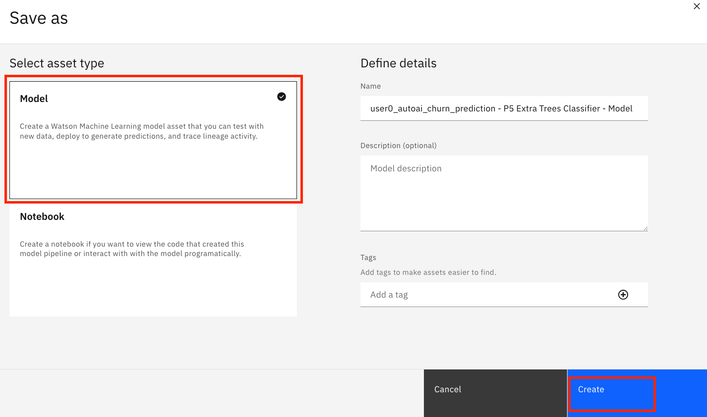

## Exercise 2: Deploy your model through deployment space
Let's promote the trained model to a UAT (Testing) Deployment Space, then deploy it so it's ready to be called for testing.

1. Navigate back to the project assets by clicking your project's name and then clicking the **Assets** tab.
   
    Click on the menu of your saved model **<YourUser\>_autoai_churn_prediction - P5 Extra Trees Classifier - Model** then click Promote to space. Note that the name of your model may be different.

    !!! warning
        Note that the name of your model may be different. Even a different classifier may have been used in your case.

    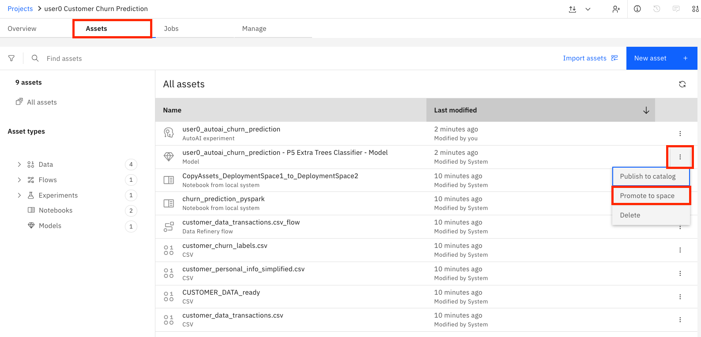

    !!! info
        **Deployment spaces** allow you to create deployments for machine learning models and functions and view and manage all of the activity and assets for the deployments, including data connections and connected data assets.

        A deployment space is not associated with a project. You can deploy assets from multiple projects to a space, and you can deploy assets to more than one space. For example, you might have a **Test** space for evaluating deployments, and a **Production** space for deployments you want to deploy in business applications.

2. On the Promote to space page, select the **churnUATspace** from Target Space drop-down. Keep the default selected version (Current) and click **Promote**.

    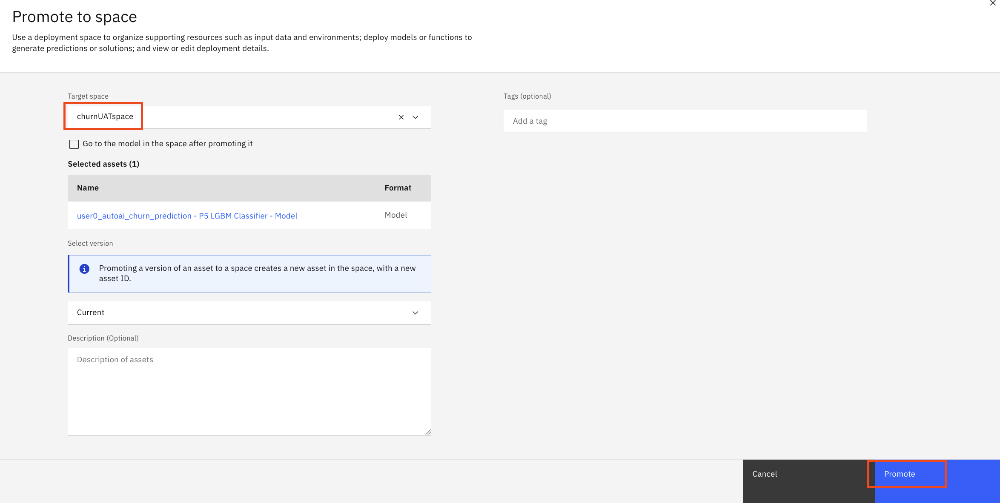

3. Once the model is successfully promoted to the deployment space, you will see a notification message. Click on the **deployment space** link to navigate to the deployment space.

    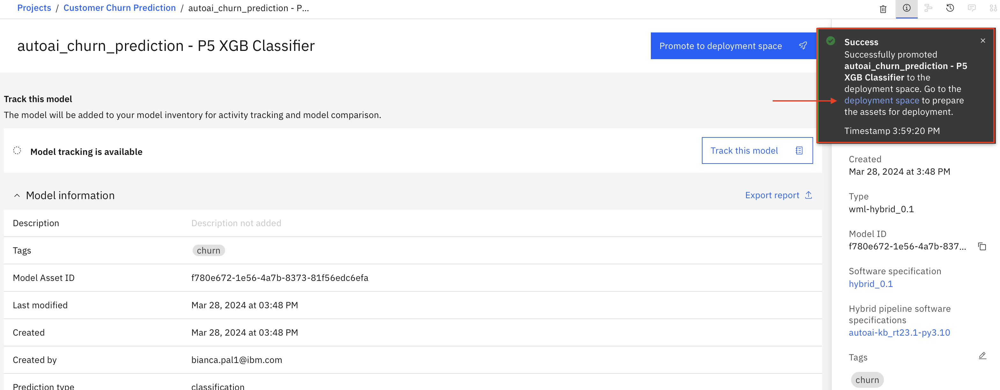

4. On the **churnUATspace** deployment space page, your AutoAI model **<YourUser\>_autoai_churn_prediction – P7 XGBClassifier** is ready to be deployed for consumption. Click on the 3-dot menu next to the model then click **Deploy**.

    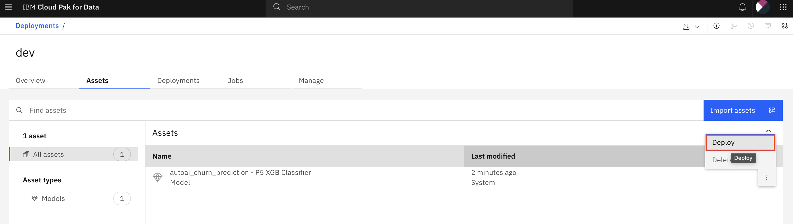

5. On the **Create a deployment** page, select **Online**, add the Name **<YourUser\>_autoai_churn** and click **Create**.

    

6. Click on the **Deployments** tab and wait until the deployment status changes to Deployed. Then click on the deployed model name **<YourUser\>_autoai_churn**.

    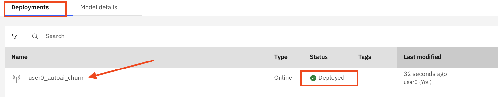

7. On the model page API reference tab, review the model Endpoint and the various Code snippets (in different coding languages) to illustrate how to make an API call to the deployed model. Then select the Test tab, click on the **Provide input data as JSON** icon, paste the following JSON sample in the **Enter input data** window and click **Predict** (blue button).

    !!! important
        Use the copy button in the code snippet below to keep the right format of the content when pasting.
    
    ```json
      {
        "input_data": [
          {
            "fields": ["ID","LONGDISTANCE","INTERNATIONAL","LOCAL","DROPPED","PAYMETHOD","LOCALBILLTYPE","LONGDISTANCEBILLTYPE","USAGE","RATEPLAN","GENDER","STATUS","CHILDREN","ESTINCOME","CAROWNER","AGE"],
            "values":[[1,28,0,60,0,"Auto","FreeLocal","Standard",89,4,"F","M",1,23000,"N",45]]
          }
        ]
      }
    ```
    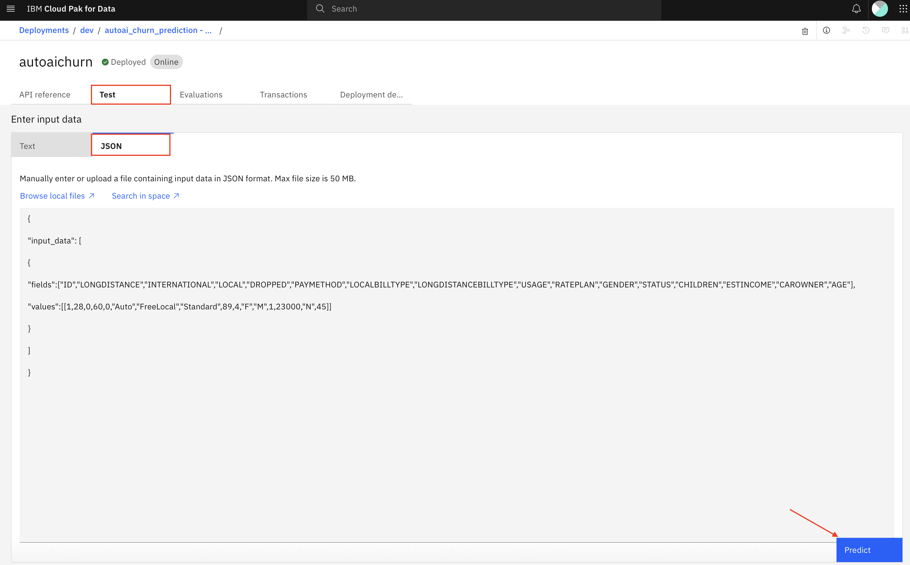
    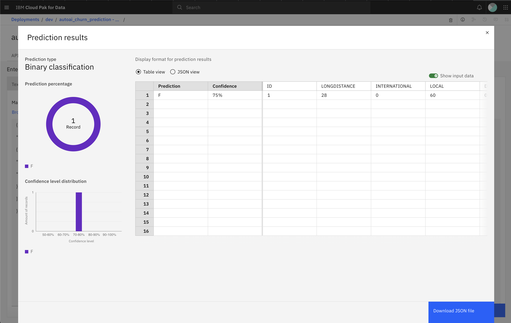

    !!! info
        The deployed model will predict the likelihood of the user to churn given the specific values for the various features. The model returns the predicted churn label as “T” (true) or “F” (false) and the probability of that prediction which effectively expresses the likelihood of that user to churn (or not). A “T” label returned by the model indicates the user is likely to churn and the corresponding probability.

        These probabilities can be used in conjunction with the predicted label to better serve customers on a more granular basis. Your application can be customized to make decisions based on the predicted label and the probabilities of that prediction.

## Exercise 3: Train Churn Prediction Model with Jupyter Notebook

In this section, we illustrate an alternate method for training AI models in Cloud Pak for Data, namely by using Jupyter notebook and open-source libraries. This is a very common and mostly preferred method by data scientists as it provides them with the utmost flexibility in exploring different algorithms for training best performing AI models.

1. Go back to your project. Then click **New asset +** and select **Jupyter notebook editor**.

    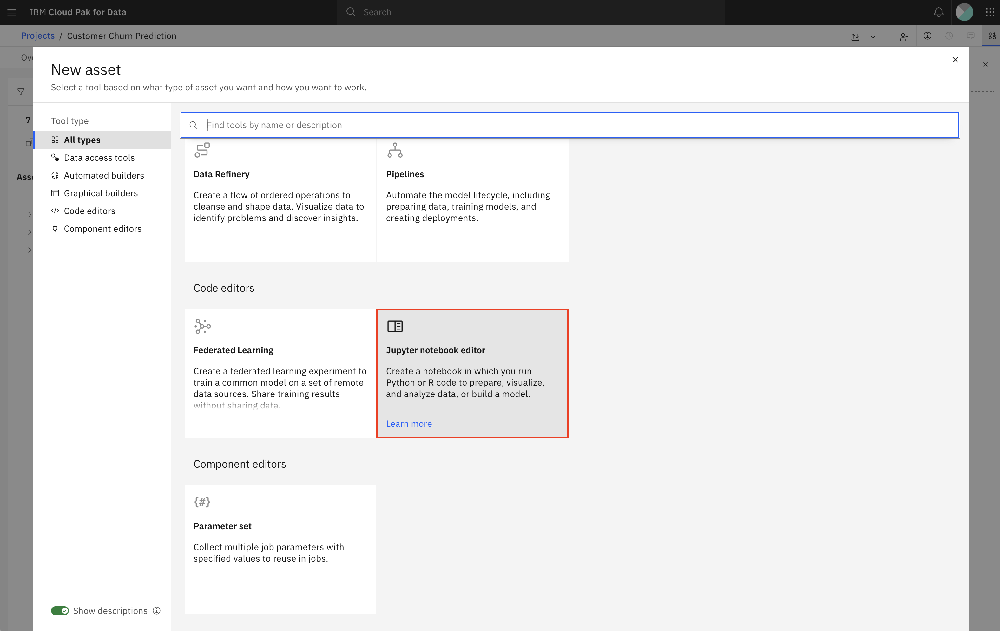

2. On the New notebook page, go to the **Local file** tab and click the **Drag and drop files here or upload**. Select the notebook that you downloaded before [churn_prediction_pyspark.ipynb](assets/churn_prediction_pyspark.ipynb) to upload it. Then, select the runtime **Default Spark 3.5 & Python 3.11** (we will be using PySpark to run this Notebook on CP4D). Finally, click **Create**.

    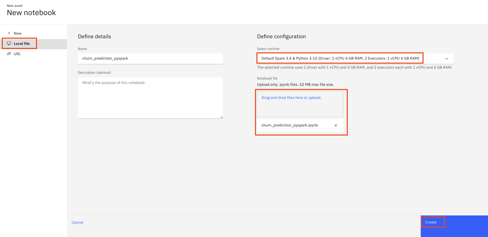

    !!! important
        **DO NOT RUN THE NOTEBOOK YET** A change is needed first to avoid all users from overiding other users' work.

3. **DO NOT RUN THE NOTEBOOK YET**. First, review the notebook comments to get an idea of what the Notebook is going to do:

    !!! info Notebook Steps
       
        a. **Access the CUSTOMER_DATA_ready dataset** from your project.
        
        b. Process the data to **prepare features** relevant for the prediction.

        c. **Train a Random Forest ML model** to predict the likelihood of customers to churn using a sample of the data.

        d. **Evaluate the model** against test data not used in training.

        e. Create the Deployment Space **churnUATspace** if it doesn't exist.

        f. Associate Watson Machine Learning with the *churnUATspace* deployment space.

        g. **Store the model** in the churnUATspace deployment space

        h. **Deploy the model** in the churnUATspace deployment space.

        i.Run a test to **validate the online deployment** of the model.

4. Go to the following lines and **add your username** to the MODEL_NAME and DEPLOYMENT_NAME variables:

    - MODEL_NAME = "<YourUser> Churn Model"
    - DEPLOYMENT_NAME = "<YourUser> Churn Deployment"
    
    ```py
    # Provide a target name for your churn model
    MODEL_NAME = "<YourUser> Churn Model"
    # Provide a target name for your churn model deployment
    DEPLOYMENT_NAME = "<YourUser> Churn Deployment"
    ```

    For example, for user0:
    
    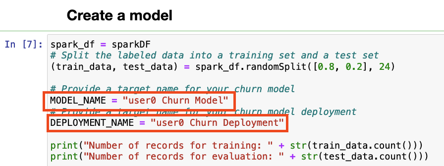

5. Now, run all the cells and review the output of each one.

6. If all cells ran successfully, your model should be deployed. Go to the Menu **Deployments**.

    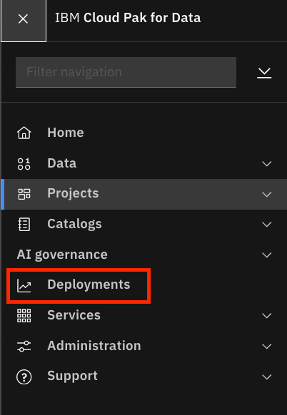

7. On the **Deployments** page, go to the tab **Spaces** and click the **churnUATspace** space.

    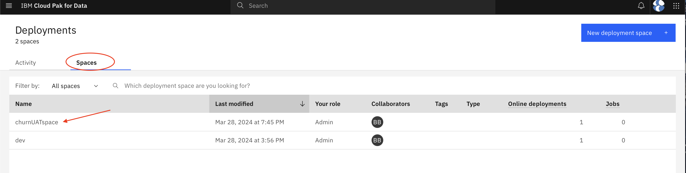

8. Go to tab **Deployments**. The model that you trained and deployed from the Jupyter Notebook is available for consumption.

    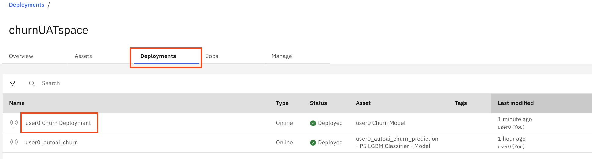


!!! info
    You have reached the end of this lab.

## End of Lab
